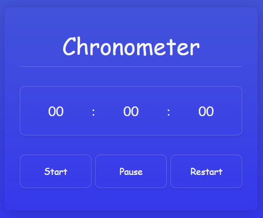

# Chronometer 🕓

### 🎯 Introduction

A simple and elegant Cronometer (stopwatch) built with HTML, CSS, and JavaScript. It features three main control buttons and is fully responsive across all devices. This project is perfect for precise time measurement with millisecond accuracy.

---

### preview 📷

## 

### ✨ Features

- ✅ Three Functional Buttons: Start, Pause, and Restart

- ✅ Fully Responsive Design: Compatible with mobile, tablet, and desktop

- ✅ Precise Time Display: Hours, minutes, seconds, and milliseconds

- ✅ Modern & Clean UI: With subtle animations and transitions

- ✅ Lightweight & Fast: No external dependencies

- ✅ Easy to Customize: Well-structured and commented code

## 🌐 Live Demo

[view live demo](https://01mehran.github.io/Chronometer/)

---

### ⚙️ installation

1. Clone the repository:

```bash
git clone https://github.com/01mehran/Chronometer.git
```

2. Navigate to the project directory:

```bash
cd Chronometer
```

3. Open index.html in your browser - no build process required!

---

### 💻 Technologies Used

- HTML5: Semantic markup

- CSS3: Flexbox, CSS Grid, media queries for responsiveness

- JavaScript (ES6+): DOM manipulation, event handling, interval timers

---

### 🤝 Contributing

1. Contributions are welcome! Here's how you can help:

2. Fork the project

3. Create a feature branch (git checkout -b feature/AmazingFeature)

4. Commit your changes (git commit -m 'Add some AmazingFeature')

5. Push to the branch (git push origin feature/AmazingFeature)

6. Open a Pull Request

> Made with ❤️ by **Mehran**
